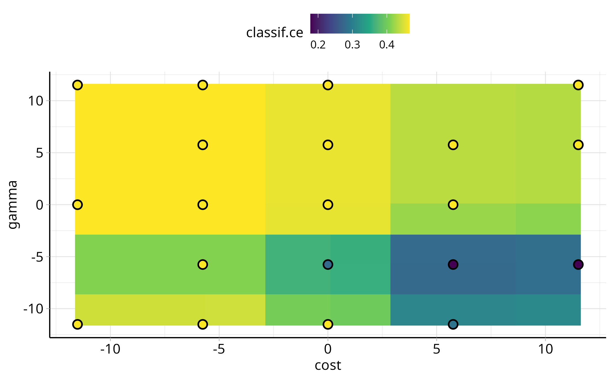

```{r, include = FALSE}
lgr::get_logger("mlr3")$set_threshold("warn")
lgr::get_logger("bbotk")$set_threshold("warn")
set.seed(1)
options(
    datatable.print.nrows = 10,
    datatable.print.class = FALSE,
    datatable.print.keys = FALSE,
    width = 100)
# mute load messages
library("mlr3tuning")
```

# mlr3tuning 

Package website: [release](https://mlr3tuning.mlr-org.com/) | [dev](https://mlr3tuning.mlr-org.com/dev/)

<!-- badges: start -->
[](https://github.com/mlr-org/mlr3tuning/actions/workflows/r-cmd-check.yml)
[](https://cran.r-project.org/package=mlr3tuning)
[](https://stackoverflow.com/questions/tagged/mlr3)
[](https://lmmisld-lmu-stats-slds.srv.mwn.de/mlr_invite/)
<!-- badges: end -->

*mlr3tuning* is the hyperparameter optimization package of the [mlr3](https://mlr-org.com/) ecosystem.
It features highly configurable search spaces via the [paradox](https://github.com/mlr-org/paradox) package and finds optimal hyperparameter configurations for any mlr3 [learner](https://github.com/mlr-org/mlr3learners).
mlr3tuning works with several optimization algorithms e.g. Random Search, Iterated Racing, Bayesian Optimization (in [mlr3mbo](https://github.com/mlr-org/mlr3mbo)) and Hyperband (in [mlr3hyperband](https://github.com/mlr-org/mlr3hyperband)).
Moreover, it can [automatically](https://mlr3book.mlr-org.com/optimization.html#sec-autotuner) optimize learners and estimate the performance of optimized models with [nested resampling](https://mlr3book.mlr-org.com/optimization.html#sec-nested-resampling).
The package is built on the optimization framework [bbotk](https://github.com/mlr-org/bbotk).

## Extension packages

mlr3tuning is extended by the following packages.

* [mlr3tuningspaces](https://github.com/mlr-org/mlr3tuningspaces) is a collection of search spaces from scientific articles for commonly used learners.
* [mlr3hyperband](https://github.com/mlr-org/mlr3hyperband) adds the Hyperband and Successive Halving algorithm.
* [mlr3mbo](https://github.com/mlr-org/mlr3mbo) adds Bayesian Optimization methods.

## Resources

There are several sections about hyperparameter optimization in the [mlr3book](https://mlr3book.mlr-org.com).

* Getting started with [Hyperparameter Optimization](https://mlr3book.mlr-org.com/optimization.html).
* [Tune](https://mlr3book.mlr-org.com/optimization.html#sec-tuning-instance) a simple classification tree on the Palmer Penguins data set.
* Learn about [Tuning Spaces](https://mlr3book.mlr-org.com/technical.html#sec-tuning-space).
* Estimate Model Performance with [Nested Resampling](https://mlr3book.mlr-org.com/optimization.html#sec-model-performance).

The [gallery](https://mlr-org.com/gallery-all-optimization.html) features a collection of case studies and demos about optimization.

* Learn more advanced methods with the [Practical Tuning Series](https://mlr-org.com/gallery/series/2021-03-09-practical-tuning-series-tune-a-support-vector-machine/).
* Optimize an rpart classification tree with only a [few lines of code](https://mlr-org.com/gallery/optimization/2022-11-10-hyperparameter-optimization-on-the-palmer-penguins/).
* Tune an XGBoost model with [early stopping](https://mlr-org.com/gallery/optimization/2022-11-04-early-stopping-with-xgboost/).
* Make us of proven [search space](https://mlr-org.com/gallery/optimization/2021-07-06-introduction-to-mlr3tuningspaces/).

The [cheatsheet](https://cheatsheets.mlr-org.com/mlr3tuning.pdf) summarizes the most important functions of mlr3tuning.

## Installation

Install the last release from CRAN:

```{r eval = FALSE}
install.packages("mlr3tuning")
```

Install the development version from GitHub:

```{r eval = FALSE}
remotes::install_github("mlr-org/mlr3tuning")
```

## Examples

We optimize the `cost` and `gamma` hyperparameters of a support vector machine on the [Sonar](https://mlr3.mlr-org.com/reference/mlr_tasks_sonar.html) data set.

```{r}
library("mlr3verse")

learner = lrn("classif.svm",
  cost  = to_tune(1e-5, 1e5, logscale = TRUE),
  gamma = to_tune(1e-5, 1e5, logscale = TRUE),
  kernel = "radial",
  type = "C-classification"
)
```

We construct a tuning instance with the `ti()` function.
The tuning instance describes the tuning problem.

```{r}
instance = ti(
  task = tsk("sonar"),
  learner = learner,
  resampling = rsmp("cv", folds = 3),
  measures = msr("classif.ce"),
  terminator = trm("none")
)
instance
```

We select a simple grid search as the optimization algorithm.

```{r}
tuner = tnr("grid_search", resolution = 5)
tuner
```

To start the tuning, we simply pass the tuning instance to the tuner.

```{r}
tuner$optimize(instance)
```

The tuner returns the best hyperparameter configuration and the corresponding measured performance.

The archive contains all evaluated hyperparameter configurations.

```{r}
as.data.table(instance$archive)[, .(cost, gamma, classif.ce, batch_nr, resample_result)]
```

The [mlr3viz](https://mlr3viz.mlr-org.com/) package visualizes tuning results.

```{r, eval=FALSE}
library(mlr3viz)

autoplot(instance, type = "surface")
```



We fit a final model with optimized hyperparameters to make predictions on new data.

```{r}
learner$param_set$values = instance$result_learner_param_vals
learner$train(tsk("sonar"))
```

